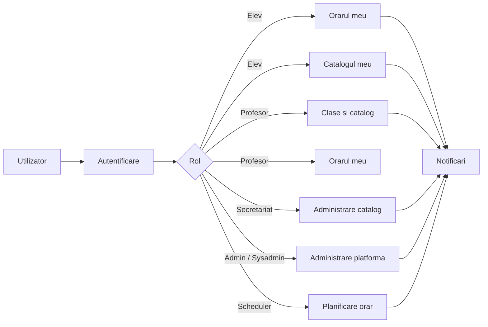
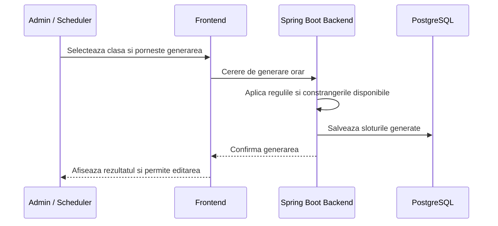
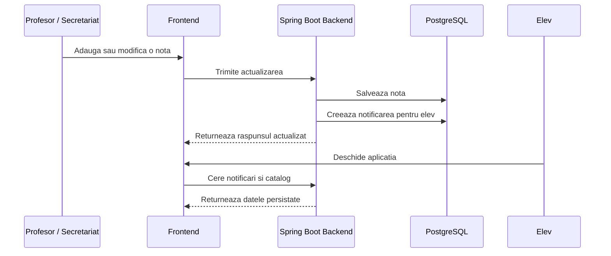

# Digitalization of Grading and School Management

## Despre proiect
Acest proiect propune o platforma web pentru liceu, gandita sa aduca in acelasi loc procese care, in mod normal, sunt raspandite intre registre, foi tiparite, fisiere Excel si discutii informale. Ideea centrala este simpla: elevii, profesorii, secretariatul si administratorii trebuie sa poata lucra pe aceleasi date, in timp real, intr-un mediu clar si usor de urmarit.

Aplicatia urmareste digitalizarea a doua zone esentiale din viata scolii: catalogul si orarul. In jurul lor sunt construite rolurile, regulile de acces, notificarile si mecanismele de administrare care fac sistemul util in practica, nu doar demonstrativ.

## Problema pe care o rezolva
In multe scoli, informatia circula greu si se pierde usor intre mai multe surse. Un elev poate sa afle tarziu ca i s-a modificat ora, un profesor poate lucra cu o versiune veche a orarului, iar secretariatul trebuie sa verifice manual date raspandite in mai multe locuri.

Prin aceasta aplicatie ne propunem sa reducem tocmai aceste probleme:
- lipsa unei surse unice de adevar pentru orar si note
- comunicarea lenta intre elevi, profesori si secretariat
- actualizari facute manual, greu de urmarit
- accesul neuniform la informatii in functie de rol
- dificultatea de a pastra istoricul schimbarilor intr-o forma clara

## Ce vrem sa obtinem cu acest proiect
Scopul final este dezvoltarea unei platforme care sa poata sustine activitatea curenta dintr-un liceu intr-un mod coerent, sigur si usor de extins. Mai concret, proiectul urmareste:
- centralizarea orarului, catalogului si datelor scolare intr-un singur sistem
- acces diferentiat in functie de rol, astfel incat fiecare utilizator sa vada doar ce ii este relevant
- notificarea rapida a elevilor atunci cand apare o schimbare importanta
- reducerea muncii administrative repetitive
- cresterea transparentei in relatia dintre elev, profesor si administratie
- crearea unei baze solide pentru dezvoltari ulterioare, precum rapoarte, statistici, module suplimentare sau reguli scolare mai complexe

## Cui se adreseaza
### Elev
Elevul isi poate vedea propriul orar, propriul catalog si notificarile care il privesc direct.

### Profesor
Profesorul isi poate vedea orele, poate lucra cu clasele la care preda si poate adauga sau modifica note doar la materia pentru care este responsabil.

### Secretariat
Secretariatul are un rol operational si poate gestiona date academice care tin de organizarea scolii si de actualizarea catalogului.

### Admin si Sysadmin
Aceste roluri acopera administrarea generala a platformei, configurarea si supravegherea functionarii corecte a sistemului.

### Scheduler
Acest rol este dedicat gestionarii zonei de planificare a orarului si separarii responsabilitatilor intre module.

## Functionalitati principale
- autentificare si autorizare pe baza de roluri
- managementul claselor si al utilizatorilor
- generare si editare de orar
- catalog digital cu note si medii
- notificari persistente pentru schimbari relevante
- persistenta datelor in baza de date
- documentare API prin OpenAPI / Swagger

## Fluxul general al aplicatiei

## Fluxul pentru generarea orarului

## Fluxul pentru catalog si notificari

## Arhitectura pe scurt
Aplicatia este construita pe o arhitectura separata pe servicii, astfel incat fiecare componenta sa aiba un rol clar:
- frontend in React, responsabil pentru interfata si interactiunea cu utilizatorul
- backend in Spring Boot, responsabil pentru logica aplicatiei, reguli de acces si expunerea API-ului
- PostgreSQL pentru persistenta datelor aplicatiei
- Keycloak pentru autentificare si managementul identitatii
- Docker Compose pentru rularea unitara a intregului sistem in mediul local

## Rezultatul urmarit
Ne dorim ca aplicatia sa fie mai mult decat un exercitiu tehnic. Obiectivul este obtinerea unui produs clar, coerent si credibil pentru un liceu, in care utilizatorii sa poata lucra natural cu datele scolare si sa simta ca informatia este mai usor de gasit, mai usor de verificat si mai usor de actualizat.

Pe termen lung, platforma poate deveni un punct central pentru organizarea activitatii scolare, cu accent pe ordine, trasabilitate si comunicare rapida intre toate partile implicate.

## Pornire locala
Proiectul poate fi pornit local cu Docker Compose, iar serviciile principale vor fi disponibile astfel:
- frontend: `http://localhost:3000`
- backend: `http://localhost:8000`
- swagger: `http://localhost:8000/swagger-ui.html`
- keycloak: `http://localhost:8181`

Pornirea se face din radacina proiectului, unde se afla fisierul `docker-compose.yml`.